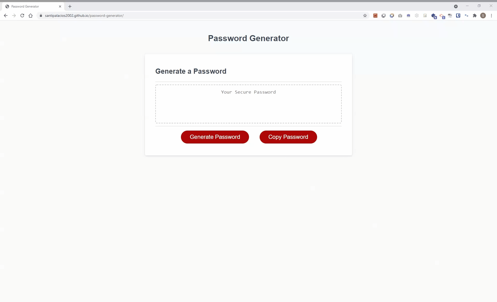
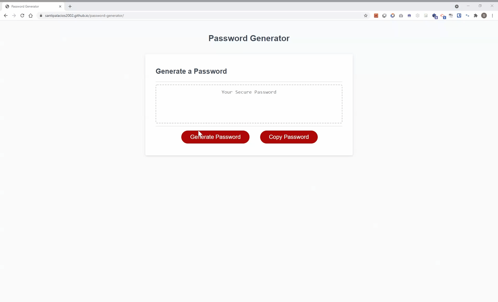
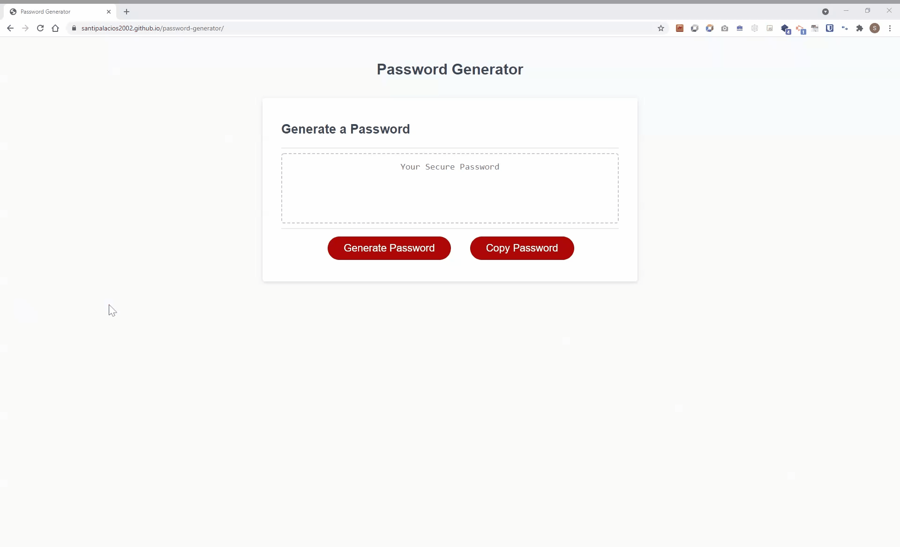

# password generator

## Homework-3 JavaScript: Password Generator

This project presents a password generator that allows users to choose the length of the password and what type of characters they would like to have as part of the password (lower case, upper case, special characters as defined by OWASP Foundation, and numbers)

You can review the current password generator application by going to the following url: https://santipalacios2002.github.io/password-generator/

 

# Acceptance criteria

## :heavy_check_mark: User is presented with a series of prompts for password criteria

User is prompted to choose:

* Length of password (between 8 and 128 characters)
* Lowercase
* Uppercase
* Numeric
* Special Characters

 

## :heavy_check_mark: Criteria validation

User must choose at least one character type
 

## :heavy_check_mark: Additional features 

* User must enter a valid value for password length

  

* If user cancels from intial prompt then user gets exited from the app

* If user presses ok in first prompt then user gets exited and has to generate password again

